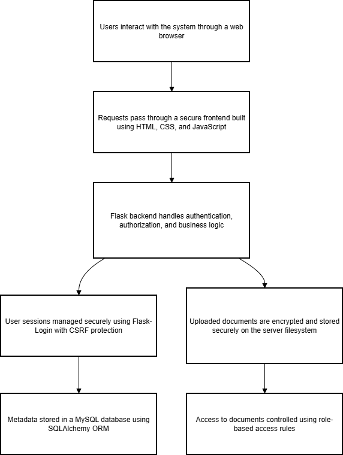
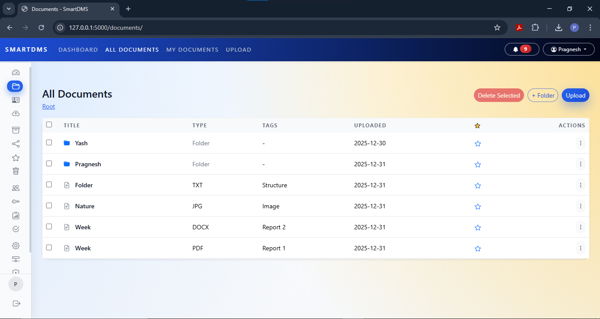

# 📄 Smart Python-Powered Documents Management System (SmartDMS)

<div align="center">


**A secure, role-based document management system built with Python & Flask for academic and internship purposes.**

[Features](#-key-features) •
[Installation](#-installation--setup) •
[Screenshots](#-screenshots) •
[Security](#-security-overview) •
[Author](#-author)

</div>

---

## 📋 Table of Contents

- [About](#-about)
- [Academic & Internship Details](#-academic--internship-details)
- [Key Features](#-key-features)
- [User Roles](#-user-roles)
- [System Architecture](#-system-architecture)
- [Project Folder Structure](#-project-folder-structure)
- [Technology Stack](#-technology-stack)
- [Installation & Setup](#-installation--setup)
- [Screenshots](#-screenshots)
- [Security Overview](#-security-overview)
- [Disclaimer](#-disclaimer)
- [Author](#-author)
- [Acknowledgement](#-acknowledgement)

---

## 📖 About

SmartDMS is a **secure, role-based document management system** developed using **Python and Flask**, designed to manage documents efficiently with a strong focus on **security, access control, and auditability**.

This project is developed as both a **BCA Final Year Project** and an **Internship Project**, incorporating enterprise-inspired security practices.

---

## 🎓 Academic & Internship Details

| Detail | Information |
|--------|-------------|
| **Project Type** | BCA Final Year Project + Internship Project |
| **College** | College of Computer Management Studies, Vadu |
| **Internship Organization** | **BISAG-N** (Bhaskaracharya National Institute for Space Applications and Geo-informatics) |

---

## ✨ Key Features

<table>
<tr>
<td width="50%">

### 🔐 Security
- Secure user authentication using Flask-Login
- CSRF protection and secure session handling
- Encrypted document storage (data-at-rest security)
- Password hashing using PBKDF2 (SHA-256)

</td>
<td width="50%">

### 📁 Document Management
- Secure file upload, download, and preview
- Document versioning support
- Document sharing with access control
- Recycle bin with restore and permanent delete

</td>
</tr>
<tr>
<td width="50%">

### 👥 Access Control
- Role-based access control (Admin & User)
- Strict authorization checks
- User management capabilities

</td>
<td width="50%">

### 📊 Audit & Tracking
- Activity logging for audit trails
- Complete traceability of actions
- Document oversight for admins

</td>
</tr>
</table>

---

## 👥 User Roles

| Role | Permissions |
|:----:|-------------|
| **🔑 Admin** | Full system access, user management, document oversight, system configuration |
| **👤 User** | Access to own documents, view/manage shared documents, personal settings |

---

## 🏗️ System Architecture

<div align="center">



*High-level system architecture showing the flow of data and security layers*

</div>

The above diagram represents the high-level architecture of SmartDMS. It demonstrates:
- How user requests flow from the frontend to the backend
- How authentication and authorization are enforced
- How documents and metadata are stored securely

---

## 📁 Project Folder Structure

```text
SmartDMS/
│
├── 📂 backend/
│   ├── 📄 app.py                 # Main application entry
│   ├── 📄 config.py              # Configuration settings
│   ├── 📂 extensions/            # Flask extensions
│   ├── 📂 models/                # Database models
│   ├── 📂 routes/                # API routes
│   └── 📂 services/              # Business logic services
│
├── 📂 frontend/
│   ├── 📂 static/
│   │   ├── 📂 css/               # Stylesheets
│   │   ├── 📂 js/                # JavaScript files
│   │   ├── 📂 images/            # Static images
│   │   ├── 📂 uploads/           # User uploads
│   │   └── 📂 screenshots/       # App screenshots
│   │
│   └── 📂 templates/             # HTML templates
│
├── 📂 storage/
│   └── 📂 files/                 # Encrypted document storage
│
├── 📄 .env                       # Environment variables
├── 📄 run.py                     # Application runner
├── 📄 requirements.txt           # Python dependencies
├── 📄 README.md                  # Project documentation
└── 📄 SECURITY.md                # Security documentation
```

---

## 🛠️ Technology Stack

<table>
<tr>
<td align="center" width="25%">

### 🐍 Backend


- Python 3.10+
- Flask
- Flask-Login
- Flask-WTF (CSRF)
- SQLAlchemy ORM

</td>
<td align="center" width="25%">

### 🎨 Frontend


- HTML5
- CSS3
- JavaScript (ES6+)

</td>
<td align="center" width="25%">

### 🗄️ Database


- MySQL 8.0+
- SQLAlchemy ORM

</td>
<td align="center" width="25%">

### 🔒 Security


- PBKDF2 (SHA-256)
- Encrypted Storage
- RBAC
- Secure Cookies

</td>
</tr>
</table>

---

## 🚀 Installation & Setup

### Prerequisites

Before you begin, ensure you have the following installed:

| Requirement | Version |
|-------------|---------|
| Python | 3.10 or higher |
| MySQL Server | 8.0 or higher |
| pip | Latest version |
| Git | Latest version |

### Step-by-Step Installation

#### 1️⃣ Clone the Repository

```bash
git clone <repository-url>
cd SmartDMS
```

#### 2️⃣ Create Virtual Environment

```bash
# Create virtual environment
python -m venv venv

# Activate virtual environment
# Windows:
venv\Scripts\activate

# macOS/Linux:
source venv/bin/activate
```

#### 3️⃣ Install Dependencies

```bash
pip install -r requirements.txt
```

#### 4️⃣ Configure Environment Variables

Create a `.env` file in the root directory:

```env
# Application Settings
SECRET_KEY=your_secret_key_here

# Database Configuration
DB_USER=your_db_user
DB_PASS=your_db_password
DB_NAME=your_db_name
DB_HOST=localhost

# Encryption Key
SMARTDMS_ENC_KEY=your_encryption_key_here
```

> ⚠️ **Important:** Never commit your `.env` file to version control!

#### 5️⃣ Initialize Database

```bash
# Create the database in MySQL
mysql -u root -p -e "CREATE DATABASE your_db_name;"

# Run migrations (if applicable)
flask db upgrade    #if migrations are enabled
```

#### 6️⃣ Run the Application

```bash
python run.py
```

#### 7️⃣ Access the Application

Open your browser and navigate to:

```
http://127.0.0.1:5000
```

---

## 🖼️ Screenshots

### 🔐 Login Page


*Secure authentication interface with HTTPS + AES encryption*

---

### 📊 Dashboard


*Main user dashboard with analytics, file type distribution, and system resources*

---

### 📋 All Documents


*Comprehensive document management view with folders, files, and actions*

---

### 📤 Upload Documents


*Simple and secure document upload interface with support for multiple file types*

---

## 🔐 Security Overview

SmartDMS follows a **Defense-in-Depth** approach with multiple security layers:

| Layer | Implementation |
|-------|----------------|
| **Authentication** | Secure session handling with Flask-Login |
| **Authorization** | Role-based access control (RBAC) |
| **Data Protection** | Encrypted storage of uploaded documents |
| **Input Validation** | CSRF protection on all forms |
| **Session Security** | Secure, HTTP-only session cookies |
| **Password Security** | PBKDF2 with SHA-256 hashing |

> 📖 For detailed security design and implementation, refer to the [SECURITY.md](SECURITY.md) file.

---

## ⚠️ Disclaimer

> **⚡ Important Notice**
>
> This project is developed for **educational and internship purposes only**.
>
> While it demonstrates strong security practices, it is **not production-ready** without:
> - A formal security audit
> - Penetration testing
> - Performance optimization
> - Scalability considerations

---

## 👨‍💻 Author

<table>
<tr>
<td align="center">

**Pragnesh Raval**

[](https://github.com/pragneshraval288-create/SmartDMS)

*BCA Final Year Student*

**Project:** SmartDMS  
**Internship:** BISAG-N

</td>
</tr>
</table>

---

## ⭐ Acknowledgement

Special thanks to:

- 🎓 **Faculty Members** — For their continuous guidance and support
- 👨‍🏫 **Mentors** — For sharing their expertise and knowledge
- 🏢 **BISAG-N** — For providing the internship opportunity and real-world exposure

---

<div align="center">

### ⭐ Star this repository if you found it helpful!

Made with ❤️ by Pragnesh Raval


</div>